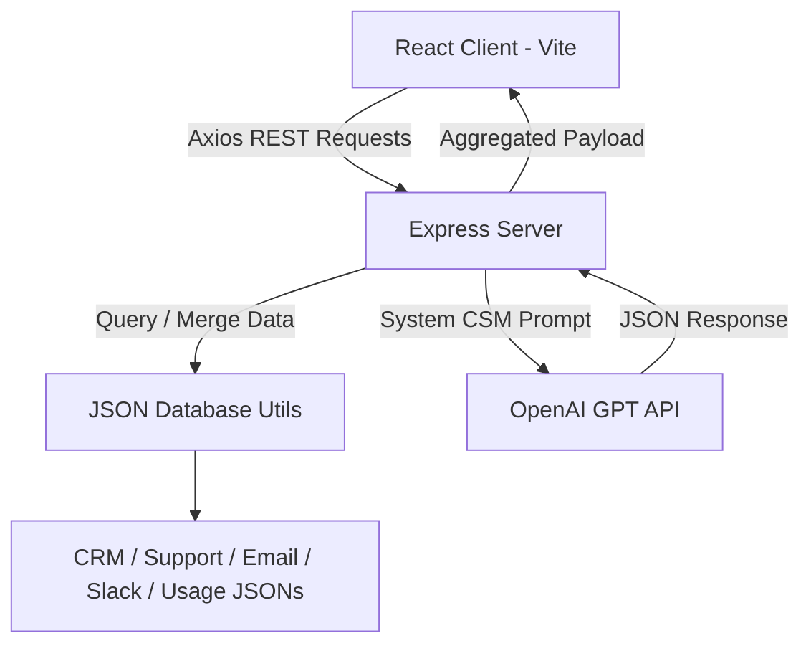

# Volopay Customer 360 AI Dashboard

A production-quality, AI-powered internal enterprise console designed to unify customer profiles from CRM, support tickets, emails, Slack, and product usage datasets. Built for Sales, Customer Success, and Growth teams to understand customer context and generate instantaneous success insights.


---

## Key Features

- **Consolidated Ledger**: Unified display of company details, industry, contract ARR/MRR, and account owner information.
- **Support Log**: Lists support tickets categorized with priority (Low, Medium, High, Critical) and status indicators.
- **Communication Logs**: Email history mapping recent messages with sentiment scoring (Positive, Neutral, Negative).
- **Internal Slack Updates**: Aggregates Slack notes, sales channel pipeline entries, and direct customer feedback.
- **Product Adoption Telemetry**: Interactive health score indicator wheel, active seat licensing metrics, and feature adoption progress bars.
- **OpenAI CSM Assessment Engine**: Generates concise executive summaries, risk reports, upsell opportunities, and recommended next best actions.
- **State Optimization**: Cache-preservation of generated insights while toggling between accounts to limit redundant API queries.
- **Premium UI / UX**: A Linear-and-Stripe-inspired interface featuring glassmorphic accents, skeleton loaders, and selector-based Light/Dark modes.

---

## Project Architecture

The application adopts a decoupled client-server architecture utilizing RESTful JSON APIs.



---

## Folder Structure

```text
customer-360-ai/
├── client/                     # React Frontend
│   ├── src/
│   │   ├── components/         # Modular Dashboard cards
│   │   │   ├── CRMDetails.jsx
│   │   │   ├── SupportTickets.jsx
│   │   │   ├── EmailHistory.jsx
│   │   │   ├── SlackNotes.jsx
│   │   │   ├── ProductUsage.jsx
│   │   │   └── AiInsights.jsx
│   │   ├── App.jsx             # State manager & layout grid
│   │   ├── main.jsx            # React root entry
│   │   └── index.css           # Custom styles & design tokens
│   ├── tailwind.config.js
│   ├── postcss.config.js
│   ├── vite.config.js
│   └── package.json
│
├── server/                     # Express Backend
│   ├── src/
│   │   ├── data/               # Realistic dummy JSON datasets
│   │   │   ├── crm.json
│   │   │   ├── tickets.json
│   │   │   ├── emails.json
│   │   │   ├── slack.json
│   │   │   └── usage.json
│   │   ├── routes/             # Router mappings
│   │   │   └── customerRoutes.js
│   │   ├── controllers/        # Request controllers
│   │   │   └── customerController.js
│   │   ├── services/           # OpenAI completion connector
│   │   │   └── openaiService.js
│   │   └── utils/              # Data load & merge helper
│   │       └── db.js
│   ├── server.js               # Express bootstrapper
│   ├── .env                    # Config template
│   └── package.json
│
└── README.md
```

---

## Installation & Local Setup

### Prerequisites

- Node.js (v18 or higher)
- npm (v9 or higher)

### 1. Configure the Backend Server

```bash
cd server
npm install
```

Create a `.env` file inside `server/` with the following variables:

```ini
PORT=5001
OPENAI_API_KEY=your_openai_api_key_here
```

Start the backend:
```bash
# Run in development mode (with nodemon)
npm run dev

# Run in production mode
npm start
```

### 2. Configure the Frontend Client

```bash
cd client
npm install
```

Start the client dev server:
```bash
npm run dev
```
Open [http://localhost:5173/](http://localhost:5173/) in your web browser.

---

## How the AI Works

The backend utilizes the OpenAI GPT model (`gpt-4o`) to simulate a Customer Success Manager (CSM) review.

1. **Information Ingestion**: Upon clicking "Generate Insights", the frontend POSTs the unified client payload containing their profile and activity details to `/generate-summary`.
2. **Context Synthesis**: The server builds a text prompt string containing:
   - CRM particulars (Subscription plan, MRR, Account owner).
   - Core support ticket logs.
   - Email thread sentiments.
   - Internal Slack notes.
   - Feature adoption statistics.
3. **OpenAI Evaluation**: It queries OpenAI Chat Completions using `response_format: { type: "json_object" }` to ensure strict JSON output.
4. **Insights Fallback**: If an `OPENAI_API_KEY` is not provided or fails, a custom heuristics engine parses the customer's metrics (low health scores, critical issues, negative emails) to return a structured fallback review so the dashboard remains fully operational.

---

## API Documentation

### 1. Get All Customers
- **Endpoint**: `GET /customers`
- **Description**: Returns all customers with basic CRM profile details and usage health scores for sidebar listing.
- **Response Format**: `JSON Array`
- **Example Response**:
  ```json
  [
    {
      "customerId": "cust-001",
      "customerName": "Acme Corporation",
      "company": "Acme Corp",
      "industry": "Manufacturing & Logistics",
      "accountOwner": "Sarah Jenkins",
      "subscriptionPlan": "Enterprise",
      "mrr": 8500,
      "status": "Active",
      "healthScore": 72,
      "activeUsers": 128
    }
  ]
  ```

### 2. Get Merged Customer Details
- **Endpoint**: `GET /customer/:id`
- **Description**: Returns fully merged customer data (CRM details, Support tickets, Email threads, Slack updates, Product usage stats).
- **Parameters**: `id` (Customer ID, e.g. `cust-001`)
- **Response Format**: `JSON Object`
- **Example Response**:
  ```json
  {
    "customerId": "cust-001",
    "customerName": "Acme Corporation",
    "company": "Acme Corp",
    "industry": "Manufacturing & Logistics",
    "accountOwner": "Sarah Jenkins",
    "subscriptionPlan": "Enterprise",
    "mrr": 8500,
    "status": "Active",
    "tickets": [
      {
        "ticketId": "TCK-101",
        "issue": "API integrations failing with 504 gateway timeout...",
        "priority": "High",
        "status": "In_Progress",
        "createdDate": "2026-07-10T08:30:00Z"
      }
    ],
    "emails": [],
    "slackNotes": {},
    "productUsage": {}
  }
  ```

### 3. Generate AI Insights Summary
- **Endpoint**: `POST /generate-summary`
- **Description**: Accepts the unified customer JSON object and returns structured success metrics.
- **Request Body**: `Merged Customer Object` (as returned by `GET /customer/:id`)
- **Response Format**: `JSON Object`
- **Example Response**:
  ```json
  {
    "summary": "Acme Corporation is experiencing stable overall product adoption, but has raised support requests about bulk syncing timeouts.",
    "risks": [
      "Bulk sync 504 timeouts are blocking API operations.",
      "MRR renewal coming up in September requires stabilization."
    ],
    "opportunities": [
      "Upsell the Advanced AI analytics module (+$2k MRR).",
      "Hold a developer workshop on API rate limits."
    ],
    "nextBestAction": "Schedule a joint troubleshooting call between Acme's developer team and Support Lead Sarah Jenkins."
  }
  ```

---

## Deployment Steps

### Frontend Deployment (Vercel)
1. Install Vercel CLI: `npm install -g vercel`.
2. Navigate to `client/` and run `vercel`.
3. Provide your environment variable `VITE_API_URL` pointing to your deployed backend URL.

### Backend Deployment (Render)
1. Create a Web Service on Render linked to your project repository.
2. Specify the Root Directory as `server`.
3. Configure build command: `npm install` and start command: `node server.js`.
4. Add the `OPENAI_API_KEY` under Environment Variables.

---

## Future Improvements

1. **Authentication & Roles**: Implement JWT authentication to restrict access to CRM details based on role (CSM vs. Executive).
2. **WebSocket Integration**: Connect with real-time Slack/support feeds to push updates without manual dashboard reloads.
3. **Customer Segmentation**: Add filters based on MRR brackets or health score tiers in the customer ledger.
