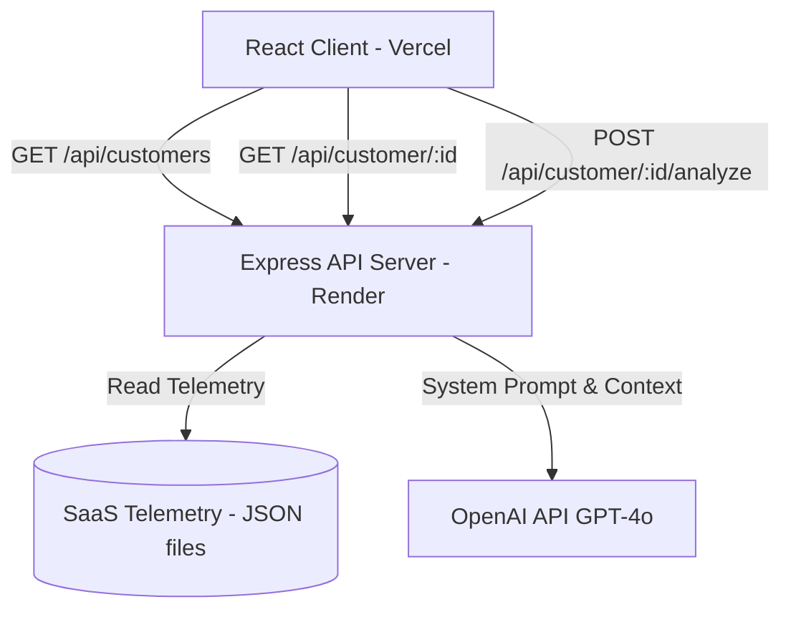

# 📄 Approach & Architecture Document — Customer 360 AI Dashboard

This document details the architectural design, development phases, OpenAI integration logic, visual guidelines, and deployment topology implemented for the **Customer 360 AI Dashboard**.

---

## 1. Executive Summary & Goals

The Customer 360 AI Dashboard is an enterprise-grade client intelligence tool designed for Customer Success Managers (CSMs). It aggregates disparate telemetry data (CRM, Support Tickets, Email Communications, Slack Notes, and Product Usage) into a single, cohesive pane of glass. 

### Core Objectives
*   **Unified Profile**: Merge siloed databases matching a single `customerId` across all streams.
*   **CSM-Tailored Insights**: Leverage OpenAI (or highly reliable structured local fallback models) to act as a virtual Customer Success Manager, highlighting risks, opportunities, and next actions.
*   **Premium Visual Polish**: Adhere to strict typographic rules, modern spacing hierarchy, and clean indicator badges, with full support for light/dark themes.
*   **Flawless Deployment**: Serve the frontend via Vercel and the MVC backend server via Render.

---

## 2. System Architecture

The application is built on a modern decoupled web architecture:



### 2.1 Backend (Express MVC Layer)
*   **Framework**: Express with ES Modules (`"type": "module"`).
*   **Controller Layer**: Handles API requests, performs in-memory joining of data streams, and runs OpenAI completions.
*   **Service Layer**: Encapsulates OpenAI calls, custom CSS-aligned schemas, and intelligent client fallbacks.
*   **Data Store**: Persistent static file database located in `server/data/`.

### 2.2 Frontend (React Single Page Application)
*   **Build System**: Vite.
*   **Styling Engine**: Tailwind CSS (strict v4 parameters, no custom third-party plugins to preserve build speed).
*   **Icons**: Lucide React.
*   **State Management**: React Context hooks synced with local storage state for themes.

---

## 3. Development Phases

```
┌──────────────────────────┐
│ Phase 1: Data Mocking   │ ──► Join keys matching 'customerId' across 5 files
└─────────────┬────────────┘
              ▼
┌──────────────────────────┐
│ Phase 2: Express MVC API │ ──► GET /customers, GET /customer/:id, POST /analyze
└─────────────┬────────────┘
              ▼
┌──────────────────────────┐
│ Phase 3: UI Integration  │ ──► Connect React API service, hooks, & skeletons
└─────────────┬────────────┘
              ▼
┌──────────────────────────┐
│ Phase 4: OpenAI & CS Bad │ ──► System Prompt + JSON schema validation
└─────────────┬────────────┘
              ▼
┌──────────────────────────┐
│ Phase 5: Visual Polish   │ ──► CSS transitions, health rings, sentiment tags
└──────────────────────────┘
```

### Phase 1: Data Mocking
Generated 20 realistic SaaS customers across different subscription tiers (Basic, Growth, Enterprise). Synchronized IDs across five datasets:
1.  `crm.json`: ARR, MRR, Renewal Dates, Status, Owner.
2.  `support.json`: Open & resolved tickets, priority tags.
3.  `emails.json`: Communication summaries and sentiment scoring (Positive, Neutral, Negative).
4.  `slack.json`: Unstructured notes, sales updates, and feature feedback.
5.  `usage.json`: Feature usage scores, last logins, and active user counters.

### Phase 2: Backend MVC Endpoints
*   `GET /api/customers`: Aggregates summary parameters to load the customer directory.
*   `GET /api/customer/:id`: Queries all files and returns a merged JSON payload matching the requested ID.
*   `POST /api/customer/:id/analyze`: Triggers the OpenAI CSM evaluation or generates local structured CSS fallbacks if the API key is missing.

### Phase 3: Frontend Connection & Theme Toggle
Replaced static mocks with live HTTP requests. Created responsive columns, theme toggles, and state persistence.

### Phase 4: OpenAI Integration & Structured Prompts
Instructs the LLM to act as a **Customer Success Manager** to generate four strict response nodes:
*   `executiveSummary`: A high-level, business-oriented overview.
*   `risks`: An array of objects detailing `description` and `severity` (Critical, High, Medium, Low).
*   `opportunities`: An array detailing `description` and `impact` (High, Medium, Low).
*   `nextBestAction`: An action plan outlining `primaryAction`, `expectedOutcome`, and `suggestedTimeline`.

### Phase 5: UI & Spacing Refinement
*   Applied strict font sizing (Dashboard: 36px, Card Titles: 20px, Labels: 14px).
*   Implemented SVG health rings mapping four tiers of account health (Excellent, Good, Average, Poor).
*   Added live aggregate counters for support issues and email sentiment categories at the top of their respective lists.
*   Styled Slack note columns with colored department badges.
*   Added step-by-step checklists to visual loaders.

---

## 4. Visual & Styling Standards

The project utilizes simple, semantic colors to represent insight categories without visual clutter:

| Section | Semantic Category | Color Code (Hex/Tailwind) |
|---|---|---|
| **Summary** | Purple | `text-purple-600` / `bg-purple-50` |
| **Risks** | Red | `text-rose-600` / `bg-rose-50` |
| **Opportunities** | Green | `text-emerald-600` / `bg-emerald-50` |
| **Next Action** | Blue | `text-blue-600` / `bg-blue-50` |
| **Confidence** | Gray | `text-zinc-600` / `bg-zinc-50` |

### Key Layout Metrics
*   **Dashboard Title**: `text-[36px]`
*   **Section Headers**: `text-[18px]`
*   **Card Titles**: `text-[20px]`
*   **Body & Descriptions**: `text-[16px]`, line height `leading-relaxed`
*   **Labels & Metadata**: `text-[14px]`, font weight `font-semibold`

---

## 5. Deployment Setup

### Frontend (Vercel)
*   **Config**: `client/vercel.json` provides rewrites supporting SPA routing.
*   **Variables**: `VITE_API_URL` environment variable is baked into the JavaScript bundle at build time.

### Backend (Render)
*   **Config**: Web Service configured with `server` as the root directory.
*   **Variables**: `PORT` and `OPENAI_API_KEY` configured in Render's Env Settings.

---

## 6. How to Run Locally

1.  **Clone & Install**:
    ```bash
    git clone https://github.com/arshad5678/Volopay_Customer_360_AI.git
    cd Volopay_Customer_360_AI
    npm install
    ```
2.  **Start Services**:
    *   **Backend** (port 5001):
        ```bash
        cd server && npm run dev
        ```
    *   **Frontend** (port 5173):
        ```bash
        cd client && npm run dev
        ```
